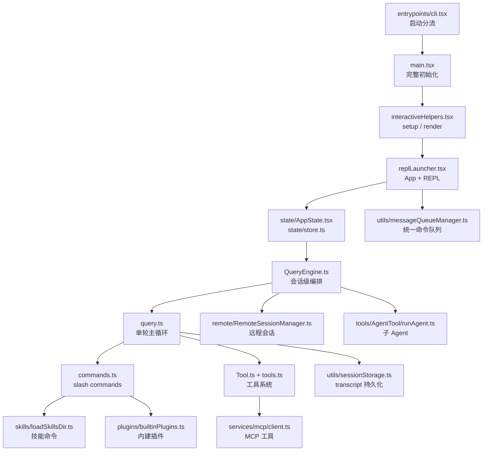
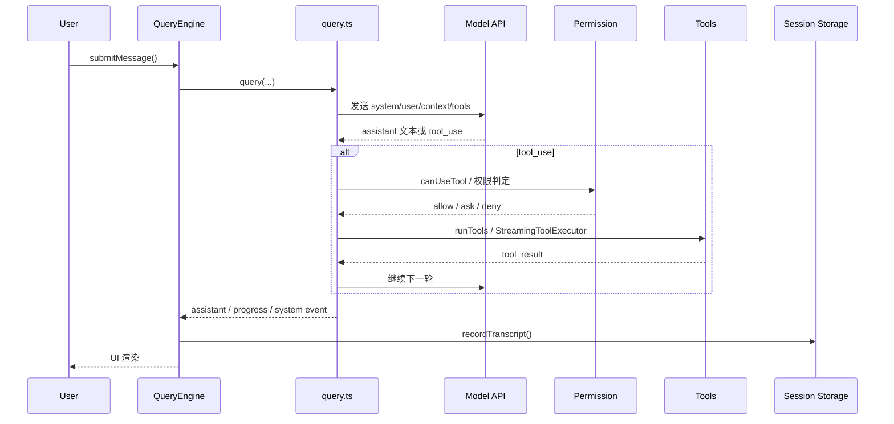

# Claude Code 架构与机制研究

> 研究对象：`/home/liangjiaqi/projects/_references/claude-code-cli-mirror`
>  
> 研究目的：为 `Claudette` 提供一个面向实现的架构参考，而不是功能清单抄写。

## 1. 先说结论

如果把 Claude Code 拆开看，它的核心并不是「很多命令」或「很多工具」，而是一个分层清楚的 Agent CLI 内核：

1. 启动层负责模式分流与依赖装配。
2. 交互层负责 Ink/React 渲染、输入队列和状态同步。
3. 编排层负责对话主循环、工具循环、预算控制和恢复。
4. 扩展层把命令、工具、技能、插件、MCP 都纳入统一抽象。
5. 远程层和多 Agent 层建立在同一套消息与工具语义之上，而不是另起炉灶。

这对 `Claudette` 的启发非常明确：

- `v1` 应该优先复用它的“骨架”，而不是追逐它的“外延能力”。
- 最值得学的是：启动分层、统一命令/工具抽象、可恢复的会话模型、权限边界、以及 UI 与核心编排的解耦。
- 最不适合在 `v1` 直接照搬的是：远程桥接、MCP 全量体系、多 Agent、海量 feature gate、超重全局状态。

## 2. 总体架构图

## 3. 一次普通对话的主链路

## 4. 核心分层与对应源码

### 4.1 启动层：先做分流，再做重初始化

对应源码：

- `entrypoints/cli.tsx`
- `main.tsx`
- `interactiveHelpers.tsx`
- `replLauncher.tsx`

关键点：

- `entrypoints/cli.tsx` 只负责极轻的 fast path 分流。像 `--version`、`remote-control`、`daemon`、后台 session 等路径会尽量避免加载整个应用。
- `main.tsx` 才是完整初始化入口：配置、鉴权、GrowthBook、策略、工具、命令、插件、技能、MCP、UI 根节点等都在这里装配。
- `interactiveHelpers.tsx` 把「显示 setup dialog」「render 主界面」「优雅退出」抽成公共流程，避免初始化逻辑和 UI 逻辑交叉污染。
- `replLauncher.tsx` 只负责把 `App` 和 `REPL` 组合起来，说明 REPL 本身只是一个壳，核心能力并不绑死在 UI 组件里。

适合 `Claudette` 学的点：

- 保留一个很薄的 CLI 分发入口。
- 把“参数解析 / 配置加载 / 依赖注入 / 进入 REPL”拆开。
- 让 REPL 只是前端壳，避免未来从行式 REPL 升级到 Ink/TUI 时重写核心逻辑。

### 4.2 状态层：React 只负责订阅，状态变化副作用集中处理

对应源码：

- `state/store.ts`
- `state/AppState.tsx`
- `state/onChangeAppState.ts`
- `components/App.tsx`

关键点：

- `state/store.ts` 的 `createStore()` 很小，只做 `getState / setState / subscribe`。
- `state/AppState.tsx` 用 `useSyncExternalStore` 包装这个 store，让 React 组件按 slice 订阅，而不是共享一个大 `useState`。
- `state/onChangeAppState.ts` 是真正重要的设计点：状态变更带来的副作用，例如权限模式同步、配置持久化、模型切换等，都集中在这里做。
- `components/App.tsx` 只是 Provider 壳，不承载业务流程。

适合 `Claudette` 学的点：

- `Claudette` 完全没必要一开始就上 Redux、XState 之类的重量方案。
- 但应该保留一个独立 store，把 UI 状态和副作用挂钩点集中管理。
- 这会让后续接入快捷键、状态栏、权限模式、通知系统时更稳。

### 4.3 统一命令队列：输入、通知、异常都走同一条通道

对应源码：

- `utils/messageQueueManager.ts`
- `hooks/useCommandQueue.ts`

关键点：

- Claude Code 不是把“用户输入”“系统通知”“待处理命令”“孤儿权限请求”分别做多条小通道，而是维护了一个统一 command queue。
- 队列支持 `now / next / later` 三档优先级。
- React 侧只通过 `useSyncExternalStore` 订阅快照，不直接拥有队列本体。

这套设计的价值很高：

- 交互顺序更可控。
- 系统消息不会轻易打断用户输入。
- 将来要加后台任务完成通知、自动恢复提示、远端事件插入时，不需要再造第二套 UI 管道。

对 `Claudette` 的建议：

- `v1` 就可以做一个简化版输入队列。
- 至少统一三类事件：用户输入、系统提示、后台任务回执。

### 4.4 编排层：`QueryEngine` 管会话，`query.ts` 管单轮

对应源码：

- `QueryEngine.ts`
- `query.ts`
- `query/config.ts`
- `query/tokenBudget.ts`
- `context.ts`

关键点：

- `QueryEngine` 是“会话级对象”。它持有消息历史、读文件缓存、累计 usage、权限拒绝记录等。
- `query.ts` 是“单轮主循环”。真正的模型调用、tool use、compact、stop hook、budget continuation 都在这里发生。
- `query/config.ts` 会在进入一轮时把若干 gate 与运行配置做一次快照，避免中途漂移。
- `query/tokenBudget.ts` 说明它不仅有“token 上限”，还有“是否值得继续”的判断，避免低收益地无限续跑。
- `context.ts` 在系统 prompt 外又补了一层 system/user context，例如 git 状态、`CLAUDE.md`、当前日期等。

这是 Claude Code 很值得学习的主干：

- UI 没有直接操作模型。
- slash command、普通对话、tool loop、session 持久化都通过统一编排层贯通。
- “一轮”与“一个会话”被清楚地区分了。

对 `Claudette` 的建议：

- `src/agent/runtime.ts` 对应 `QueryEngine`。
- `src/agent/turnLoop.ts` 对应 `query.ts`。
- `src/context/` 或 `src/agent/contextBuilder.ts` 对应 `context.ts`。
- `v1` 就应当保持这种分层，而不是把所有逻辑塞进 `startRepl()`。

### 4.5 命令系统：命令不是一个分支，而是一套统一抽象

对应源码：

- `commands.ts`
- `types/command.ts`
- `hooks/useMergedCommands.ts`

关键点：

- 命令被分成 `prompt`、`local`、`local-jsx` 三类。
- `commands.ts` 是注册中心，但它并不只注册内建命令，也会合并技能、插件命令、MCP 命令。
- `useMergedCommands.ts` 说明命令集合本身是动态可扩展的。

设计上的好处：

- “技能”在内部其实也能长成命令。
- “插件功能”不必强行走工具系统。
- 一部分命令进入模型，一部分命令纯本地执行，但用户心智统一都是 `/xxx`。

对 `Claudette` 的建议：

- `v1` 可以只做两类：`local` 和 `prompt`。
- 先不要引入 `local-jsx`，但类型设计要预留这个扩展位。

### 4.6 工具系统：工具不是函数表，而是一个完整协议

对应源码：

- `Tool.ts`
- `tools.ts`
- `hooks/useMergedTools.ts`
- `services/tools/toolOrchestration.ts`
- `services/tools/StreamingToolExecutor.ts`

关键点：

- `Tool.ts` 的 `ToolUseContext` 很丰富，说明工具并不是孤立函数，而是运行在一个带状态、带权限、带 UI、带消息历史的上下文里。
- `Tool` 接口不仅有 `call()`，还有：
  - `inputSchema / outputSchema`
  - `validateInput()`
  - `checkPermissions()`
  - `isReadOnly()`
  - `isConcurrencySafe()`
  - `interruptBehavior()`
  - 一整套 UI render 方法
- `buildTool()` 提供了默认实现，保证默认是 fail-closed 或至少行为可预测。
- `tools.ts` 是统一注册处，负责基础工具集合、按权限过滤、REPL 模式过滤、与 MCP 工具合并。
- `services/tools/toolOrchestration.ts` 会把连续的只读工具分组并行执行，而写操作或有副作用的工具串行执行。
- `services/tools/StreamingToolExecutor.ts` 进一步把“工具边流式到达、边开始执行”的能力独立出来，并处理 fallback、用户中断、并行工具互相取消等问题。

这部分对 `Claudette` 的价值非常高：

- 工具接口一旦设计对，后面加工具会非常顺。
- 并行安全、只读属性、可中断性，都是 mini 版一开始就值得保留的元数据。

对 `Claudette` 的建议：

- `v1` 至少保留：
  - schema
  - validate
  - permission/workspace check
  - `isReadOnly`
  - `isConcurrencySafe`
- UI 渲染钩子可以先省掉，只保留文本摘要。

### 4.7 权限与安全：不是一个弹窗，而是多层防线

对应源码：

- `hooks/useCanUseTool.tsx`
- `tools/FileReadTool/FileReadTool.ts`
- `tools/FileEditTool/FileEditTool.ts`
- `tools/BashTool/BashTool.tsx`

关键点：

- `useCanUseTool.tsx` 不是简单地“允许/拒绝”，而是把权限决策拆成：
  - 通用规则判断
  - 协调器模式处理
  - swarm worker 处理
  - 交互式确认
- `FileReadTool` 和 `FileEditTool` 在工具内部还有自己的输入校验与安全防护：
  - 路径展开与 deny rule 匹配
  - UNC 路径风险规避
  - 大文件限制
  - 特殊设备文件阻断
- `BashTool` 里还叠加了：
  - 只读约束检查
  - AST 级安全分析
  - sandbox 决策
  - 前台/后台任务管理
  - 用户中断语义

这说明 Claude Code 的安全边界并不只有一层：

1. 工具暴露前过滤。
2. 调用前权限决策。
3. 工具内部输入校验。
4. 运行时 sandbox / 任务隔离。

对 `Claudette` 的建议：

- `v1` 不做复杂权限模式也没关系，但一定要把“workspace 越界检查”和“工具内输入校验”落下去。
- 尤其是 `read` / `write` / `patch` / `bash` 四类工具，绝不能只在 prompt 里提醒。

### 4.8 会话持久化与恢复：不是存聊天记录，而是保存“可继续执行的轨迹”

对应源码：

- `utils/sessionStorage.ts`
- `utils/conversationRecovery.ts`
- `utils/sessionRestore.ts`
- `history.ts`
- `assistant/sessionHistory.ts`

关键点：

- `recordTranscript()` 和 `flushSessionStorage()` 说明 transcript 是一等公民。
- `conversationRecovery.ts` 在恢复时不会生搬硬套原始日志，而是会做清洗：
  - 过滤未完成的 tool use
  - 过滤不合法的 thinking message
  - 识别中断轮次
  - 注入续跑提示
- `sessionRestore.ts` 除了恢复消息，还会恢复：
  - file history
  - attribution
  - todo 状态
  - worktree/session 元数据
- `history.ts` 单独管理用户输入历史和粘贴内容。
- `assistant/sessionHistory.ts` 说明远程历史拉取也是独立能力。

最值得 `Claudette` 学的不是“存 JSONL”，而是这个理念：

- 持久化对象应该是“能恢复上下文和执行状态的轨迹”。
- resume 不是重新读档，而是一次“日志修复 + 状态重建”。

对 `Claudette` 的建议：

- `v1` 至少做：
  - transcript JSONL
  - session index
  - resume
  - 中断中的 tool use 清理
- 只要这层做对，后续 `/compact`、`rewind`、`export` 才有基础。

### 4.9 技能、插件、MCP：扩展面很多，但都汇聚到统一抽象

对应源码：

- `skills/loadSkillsDir.ts`
- `plugins/builtinPlugins.ts`
- `services/mcp/client.ts`
- `entrypoints/mcp.ts`

关键点：

- `skills/loadSkillsDir.ts` 会从多个目录加载 Markdown/frontmatter，把技能转成 `Command`。
- `plugins/builtinPlugins.ts` 说明“插件”可以同时提供技能、hook、MCP server，而且可启停。
- `services/mcp/client.ts` 把 MCP server 连接、缓存、工具抓取、鉴权、超时、输出裁剪等统一封装了。
- `entrypoints/mcp.ts` 还能把 Claude Code 自己的工具再反向暴露成 MCP server。

其中最重要的设计思想是：

- 命令、技能、插件、MCP，不是四套互斥体系，而是多种来源的能力注入方式。
- 最终都被收敛成统一的 command/tool surface。

对 `Claudette` 的建议：

- `v1` 先不要做完整插件系统。
- 但要在目录结构和类型抽象上预留：
  - 动态命令来源
  - 动态工具来源
  - Provider/MCP 适配层

### 4.10 远程与桥接：远程只是另一种传输，不是另一套 Agent

对应源码：

- `remote/RemoteSessionManager.ts`
- `bridge/replBridge.ts`
- `bridge/bridgeMain.ts`
- `bridge/createSession.ts`

关键点：

- `RemoteSessionManager` 把远端会话拆成：
  - WebSocket 收消息
  - HTTP 发消息
  - control request/response 处理权限交互
- `replBridge.ts` 负责把本地 REPL 会话接到桥接会话上，本质上是在适配 transport。
- `bridgeMain.ts` 是大规模 bridge loop，包括注册环境、拉 work、spawn session、heartbeat、失败恢复。
- `createSession.ts` 说明远程 session 创建也尽量复用本地的 message 结构。

这层的启发是：

- 远程不是“再做一个云端 Claude Code”。
- 更合理的做法是：保持同一条消息协议，再换 transport。

对 `Claudette` 的建议：

- `v1` 不做。
- 但如果以后要做远程执行，应该从“消息协议与 transport 分离”开始，而不是从“做个 web 版”开始。

### 4.11 多 Agent 与任务：本质是复用同一套 query/runtime

对应源码：

- `Task.ts`
- `tools/AgentTool/runAgent.ts`
- `tools/shared/spawnMultiAgent.ts`

关键点：

- `Task.ts` 把后台/本地/远端/工作流任务抽象成统一任务模型。
- `runAgent.ts` 没有重写一套 AI 执行引擎，而是继续复用 `query()`，只是在子上下文里运行。
- 子 Agent 也有自己的 transcript sidechain 和 metadata。
- `spawnMultiAgent.ts` 关注的是“怎么启动 teammate”，而不是“怎么重新发明 agent 语义”。

对 `Claudette` 的建议：

- `v1` 不做多 Agent。
- 未来若做，也应该基于同一个 `runtime` 克隆子上下文，而不是复制一套新的 REPL/Provider/Tool loop。

## 5. Claude Code 架构的主要优点

### 5.1 真正做到了 UI 与内核分离

- Ink/React 很重，但并没有污染核心查询循环。
- `QueryEngine` 和 `query.ts` 天然适合被 SDK、REPL、远程模式复用。

### 5.2 命令、工具、技能、插件、MCP 最终被收敛成统一表面

- 这让系统扩展时不会越来越碎。
- 也解释了为什么 Claude Code 功能很多，但用户心智还算统一。

### 5.3 安全模型是分层的

- 不是“只靠 prompt 提醒模型谨慎”。
- 而是工具注册、调用权限、输入校验、运行时 sandbox 多层叠加。

### 5.4 会话恢复能力很强

- transcript 不是日志附属品，而是产品主数据。
- resume、compact、rewind、remote attach 这些能力都有共同底座。

### 5.5 可以渐进演化

- 单用户 REPL、远程控制、多 Agent、MCP，其实都沿着一套核心语义生长出来。
- 这说明早期抽象虽然重，但方向是对的。

## 6. 不建议直接照搬的部分

### 6.1 过重的全局状态

`bootstrap/state.ts` 中聚合了大量跨域状态。对于成熟产品这是现实结果，但对 `Claudette` 来说会过早复杂化。

建议：

- `Claudette` 只保留最小 bootstrap 全局状态。
- 其余尽量下沉到 runtime、session、provider、repl 自己的模块里。

### 6.2 过多的 feature gate

Claude Code 需要同时面对内部功能、外部版本、实验开关、组织策略，因此源码里大量使用 `feature(...)` 和运行时 gate。

建议：

- `Claudette` 只保留少量显式配置。
- 不要在项目早期引入大规模实验开关。

### 6.3 过于重量的工具接口

`Tool` 接口非常完整，但对迷你版来说太大。

建议：

- `v1` 先实现 30% 的字段。
- 但接口方向要对，尤其是 `schema / validate / permission / readonly / concurrency` 这几个关键元数据。

### 6.4 远程桥接与多 Agent

这两块都不是“加几个文件”能完成的，需要稳定的消息协议、权限回传、任务管理和状态同步。

建议：

- 明确放到 `v2+`。

## 7. 对 Claudette 的模块映射建议

结合当前设计文档 `docs/superpowers/specs/2026-03-31-claudette-design.md`，建议这样映射：

| Claude Code 概念 | 对应源码 | Claudette 建议模块 | `v1` 取舍 |
|---|---|---|---|
| 启动分流 + 完整初始化 | `entrypoints/cli.tsx`、`main.tsx`、`interactiveHelpers.tsx` | `src/app/bootstrap.ts`、`src/app/container.ts`、`src/cli/entry.ts` | 必做，做简化版 |
| UI 壳与状态容器 | `components/App.tsx`、`state/AppState.tsx`、`state/store.ts` | `src/repl/`、`src/repl/state.ts` | 必做，保持轻量 |
| 统一命令队列 | `utils/messageQueueManager.ts` | `src/repl/inputQueue.ts` | 推荐加入 |
| 会话级编排 | `QueryEngine.ts` | `src/agent/runtime.ts` | 必做 |
| 单轮对话与工具循环 | `query.ts` | `src/agent/turnLoop.ts`、`src/agent/toolLoop.ts` | 必做 |
| 命令抽象与注册中心 | `types/command.ts`、`commands.ts` | `src/commands/types.ts`、`src/commands/registry.ts` | 必做 |
| 工具协议与注册中心 | `Tool.ts`、`tools.ts` | `src/tools/types.ts`、`src/tools/registry.ts` | 必做 |
| 路径/权限边界 | `useCanUseTool.tsx`、`FileReadTool.ts`、`FileEditTool.ts` | `src/workspace/policy.ts`、`src/tools/policies.ts` | 必做，但做简化版 |
| transcript 与 resume | `utils/sessionStorage.ts`、`utils/conversationRecovery.ts`、`utils/sessionRestore.ts` | `src/session/store.ts`、`src/session/index.ts`、`src/session/resume.ts` | 必做 |
| 技能系统 | `skills/loadSkillsDir.ts` | `src/features/skills/` 或未来扩展目录 | `v1` 先留接口，不落地 |
| 插件系统 | `plugins/builtinPlugins.ts` | `src/features/plugins/` | `v1` 不做 |
| MCP 客户端/服务端 | `services/mcp/client.ts`、`entrypoints/mcp.ts` | `src/integrations/mcp/` | `v1` 不做，但抽象预留 |
| 远程桥接 | `bridge/**`、`remote/**` | `src/remote/` | `v1` 不做 |
| 多 Agent / 任务体系 | `Task.ts`、`tools/AgentTool/runAgent.ts` | `src/agent/subagents/`、`src/tasks/` | `v1` 不做 |

## 8. Claudette 的推荐落地顺序

### 第一阶段：先做最小闭环

- CLI 入口与 bootstrap。
- 行式 REPL。
- `runtime + turnLoop + toolLoop`。
- `commands + tools + provider + session + workspace`。

### 第二阶段：补强真实产品感

- 统一命令队列。
- 更明确的权限模式与工具元数据。
- 更稳的 resume 和 transcript 恢复。
- `patch`/diff 级编辑反馈。

### 第三阶段：扩展面

- 技能目录。
- MCP 接入。
- 特色命令与项目内知识沉淀。

### 第四阶段：高级能力

- 多 Agent。
- 远程桥接。
- 全屏 TUI。

## 9. 最终建议

如果 `Claudette` 的目标是“教学型最小闭环”，最值得继承 Claude Code 的不是它的功能规模，而是这 5 个结构原则：

1. 启动层、UI 层、编排层、扩展层分离。
2. 会话对象与单轮对象分离。
3. 命令与工具统一建模，但职责不同。
4. transcript 是主数据，不是日志附件。
5. 安全边界写进运行时，而不是写进 prompt。

按这个方向做，`Claudette` 即使只实现 20% 的功能，也会像一个真正可演进的 Agent CLI；如果只模仿表层命令和工具名，最后更像一个堆功能的 Demo。
